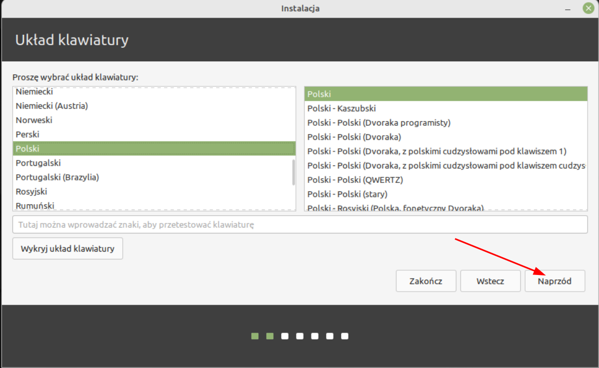
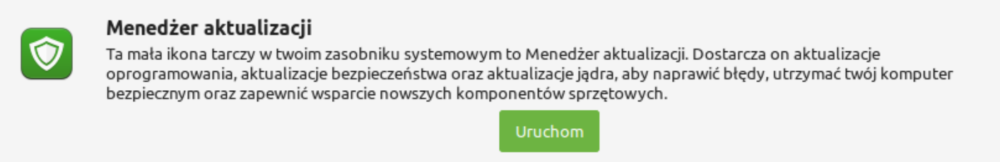

# Linux Mint - Samouczek

- [Linux Mint - Samouczek](#linux-mint---samouczek)
  
  + [1. wstęp](#1-wstęp)
  
  + [2. Wybór wersji.](#2-wybór-wersji)
  
  + [3. Wymagania Minimalne](#3-wymagania-minimalne)
  
  + [4. Pobieranie obrazu i instalacja](#4-pobieranie-obrazu-i-instalacja)
    
    - [Pobieranie obrazu](#pobieranie-obrazu)
    
    - [Tworzenie pendrive'a z instalatorem](#tworzenie-pendrive-z-instalatorem)
    
    - [Uruchamianie](#uruchamianie)
    
    - [Instalacja](#instalacja)
      
      + [1. Wybór języka](#1-wybór-języka)
      + [2. Wybór układu klawiatury](#2-wybór-układu-klawiatury)
      + [3. Zezwolenie na kodeki multimediów](#3-zezwolenie-na-kodeki-multimediów)
      + [4. Rodzaj instalacji](#4-rodzaj-instalacji)
      + [5. Lokalizacja użytkownika (Region)](#5-lokalizacja-użytkownika)
      + [6. Konfiguracja konta użytkownika](#6-konfiguracja-konta-użytkownika)
  
  + [Konfiguracja](#konfiguracja)
    - [Interfejs użytkownika](#interfejs-użytkownika)
      + [Kolory pulpitu](#kolory-pulpitu)
      + [Układ panelu](#układ-panelu)
    - [System migawek](#system-migawek)
    - [Menedżer sterowników](#menedżer-sterowników)
    - [Menedżer aktualizacji](#menedżer-aktualizacji)
      + [Zmiana serwerów lustrzanych](#zmiana-serwerów-lustrzanych)
      + [Przeprowadzanie aktualizacji](#przeprowadzanie-aktualizacji)
  
   

Linux Mint to przyjazny użytkownikowi system operacyjny.  W tym samouczku w sposób dokładny przejdziemy przez jego instalację, konfigurację i zbadamy każdy jego zakamarek.

Mint cechuje się przede wszystkim przyjaznym podejściem do użytkownika, nastawieniem na prywatność, stabilność i filozofią "work out of the box (OOTB)" - znaczy to, że odrazu po instalacji system jest zaopatrzony w większosć narzędzi potrzebnych do pracy np. pakiet biurowy. Domyślna wersja Linux'a Mint bazuje na systemie Ubuntu - po krótce znaczy to, że systemy są ze sobą kompatybilne i dzielą miedzy sobą różne elementy  (Więcej o nich później). Wyróżnić można również wersję LMDE (Linux Mint Debian Edition), która bazuje bezpośrednio na debianie - jest ona okrojona z niektórych funkcji np. zarządzania sterownikami, dlatego zajmiemy się jedynie pochodnymi Ubuntu. 

### 2. Wybór wersji.

    Linux Mint dzieli się na 3 główne wersje - Cinnamon, Xfce4 oraz Mate. Różnią się one przede wszystkim Środowiskiem Graficznym, z jakiego korzystają. 
    Cinnamon jest najpopularniejszym wyborem wśród użytkowników. Jest to DE stworzone na podstawie bibliotek gnome (Gtk2/3) na potrzeby Linuksa Mint. Posiada klasyczny panel ustanowiony w dolnej części ekranu, przypominający ten z systemu Windows. Ponieważ Mate oraz Xfce są wolniej rozwijane i brakuje im niektórych funkcji, w tym poradniku skupimy się jedynie na wersji Cinnamon.

### 3. Wymagania Minimalne

Przed rozpoczęciem naszej przygody zapoznajmy się z rekomendowanymi wymaganiami sprzętowymi, które musimy spełnić, aby komfortowo korzystać z Miętki.

| Kryteria      | Minimalne            | Zalecane            |
| ------------- | -------------------- | ------------------- |
| Procesor      | Architektura 64 bit  | Architektura 64 bit |
| Pamięć RAM    | 1 GB pamięci RAM     | 2GB pamięci RAM     |
| Rozdzielczość | 1024×768             | 1920x1080           |
| Dysk          | 15GB wolnego miejsca | Ponad 20GB          |

Jeżeli twoje urządzenie spełnia te warunki, możesz zainstalować Minta! Teraz liczą się tylko chęci.

### 4. Pobieranie obrazu i instalacja

#### Pobieranie obrazu

    Aby pobrać obraz systemu Linux Mint udajemy się na stronę [All Versions - Linux Mint](https://linuxmint.com/download_all.php) i wybieramy najnowszą dostępną wersję ze środowiskiem Cinnamon. Jeżeli masz bardzo nowy sprzęt i domyślny obraz nie działa na twoim komputerze - wybierz wersję z dopiskiem "Edge" ***uwaga, wersja edge może być mniej stabilna od innych obrazów***

#### Tworzenie pendrive z instalatorem

    Super, mamy już obraz naszego systemu. Teraz musimy utworzyć pendrive rozruchowy, potrzebny do uruchomienia Minta na naszym komputerze. Pobieramy program Etcher ze strony [balena.io](https://www.balena.io/etcher/) i pobieramy wersję zgodną z naszym aktualnym systemem operacyjnym. W przypadku systemu Windows najwygodniej wybrać wersję portable nie wymagającą instalacji. Uruchamiamy program i powinniśmy zobaczyć 3 kroki do wykonania. 

1. Klikamy "Flash from file" i wybieramy plik .iso który pobraliśmy ze strony Linux Mint.

2. Podłączamy do komputera pendrive'a i wybieramy go z listy po kliknięciu "Select target" **Uwaga, wszystkie dane z wybranego pendrive'a zostaną usunięte!**

3. Klikamy "Flash!". Cały proces może potrwać od kilku do kilkunastu minut. W tym czasie można zrobić sobie kawę ☕

#### Uruchamianie

    Gdy proces tworzenia pendrive zakończył się powodzeniem, uruchamiamy komputer ponownie i wchodzimy do Bios'u. Aby system działał poprawnie musimy znaleźć i upewnić się, że opcja "Secure Boot" jest **wyłączona**. Gdy wszystko się już zgadza, uruchamiamy komputer jeszcze raz i wchodzimy w tzw. Menedżer rozruchu (Boot Menu). Podczas uruchamiania się komputera należy kliknąć specjalny klawisz, zazwyczaj jest on wypisany na ekranie podczas startu - Jeżeli nie, to najlepiej wyszukać taką informację w internecie. Poniżej tabelka z możliwymi klawiszami u poszczególnych producentów.

| Producent | Boot Menu   | BIOS         |
| --------- | ----------- | ------------ |
| Dell      | F12         | F2           |
| Lenovo    | F12, Fn+F11 | F1, F2       |
| HP        | Esc, F9     | F1, F10, Esc |
| Asus      | F8, Esc     | F9, Del      |
| Huawei    | F12         | F2, Del      |

    Naszym oczom powinno ukazać się menu. Szukamy w nim naszego pendrive'a i zatwierdzamy enterem. Teraz pokaże się grub, jest to menu które pozwala wybrać opcję uruchamiania. Wybieramy pierwszą opcję. Brawo! Udało nam się uruchomić Linux'a Mint w trybie live cd. Jeżeli wszystko wykonaliśmy poprawnie, to w tym momencie naszym oczom powinien ukazać się pulpit. Teraz najlepiej sprawdzić czy system nam odpowiada, pobawić się. Nic nie zostanie zapisane. Gdy jesteśmy już pewni, że chcemy zainstalować Mint'a na naszym sprzęcie uruchamiamy instalator zlokalizowany na pulpicie. Aby to zrobić wystarczy 2 razy kliknąć na ikonkę wskazaną na zdjęciu poniżej.

#### Instalacja

Instalator ubiquity w systemie Linux Mint składa się z 6 następujących kroków.

1. Wybór języka

2. Wybór układu klawiatury

3. Zezwolenie na kodeki multimediów

4. Typ instalacji (Partycjonowanie)

5. Wybór regionu

6. Konfiguracja konta użytkownika

Instalator może również poprosić cię o hasło do sieci wi-fi. 

###### 1. Wybór języka

Krok bardzo prosty, wybieramy z listy język który będzie towarzyszyć nam przy instalacji oraz na nowo zainstalowanym systemie. 

###### 2. Wybór układu klawiatury

Czas na wybór układu klawiatury! Z racji, że w poprzednim kroku zaznaczyliśmy język polski, instalator "domyślił" się i wybrał nam odpowiednią opcję - Polski. Warto zauważyć, że Linux Mint nie ma układu "Polski programisty" a zwyczajnie Polski.

###### 3. Zezwolenie na kodeki multimediów

Krok 3 jest zdecydowanie najprostszy ze wszystkich, wystaczy że zaznaczymy pole wyboru i przejdziemy dalej. 

###### 4. Rodzaj instalacji

Mint'a można zainstalować na całej przestrzeni dyskowej oraz obok istniejącego już systemu. Na ten moment zajmiemy się instalacją mięty jako jedyny docelowy system na dysku. Wybieramy "Wyczyszczenie dysku i zainstalowanie Linux Mint" a następnie klikamy "Zainstaluj".

Instalator poprosi jeszcze o potwierdzenie, **tego kroku nie da się cofnąć - wszyskie dane na dysku zostaną usunięte**.

###### 5. Lokalizacja użytkownika

Teraz możemy wykazać się naszą znajomością geografii i zaznaczyć na mapie Warszawę. Można również wybrać pożądany region z rozwijanej listy pod mapą.

###### 6. Konfiguracja konta użytkownika

To już ostatni krok, uzupełniamy potrzebne informacje. Jeżeli już podniosło ci się ciśnienie, że system prosi cię o imię i nazwisko to spokojnie, te dane wykorzystywane są jedynie lokalnie m. in do konfiguracji klienta poczty Thunderbird. Wybieramy nazwę użytkownika (musi zaczynać się z małej litery) i ustawiamy hasło - jest to wymagane. Jeżeli nie chcemy podawać hasła przy uruchamianiu komputera, zaznaczamy opcję "Automatyczne logowanie".

To już wszystko! Proces instalacji może potrwać nawet kilkanaście minut. Teraz dla odmiany można udać się na herbatkę :)

Po zakończonej instalacji uruchamiamy komputer ponownie i wyciągamy pendrive'a.

To już wszystko! Teraz czeka nas podstawowa [konfiguracja](#3-Konfiguracja)

### Konfiguracja

Po ponownym uruchomieniu komputera ujrzymy ekran powitalny. Będzie on się pojawiał przy każdym następnym uruchomieniu, chyba że odznaczymy pole zaznaczone na zdjęciu poniżej numerem 1. Następnie klikamy kartę "Pierwsze kroki" aby przejść do najważniejszych ustawień. 

**Jeżeli interfejs jest za mały, możesz najpierw przejść do [kroku 6]()**

Powinniśmy zobaczyć 8 różnych proponowanych opcji konfiguracji.

1. Kolory pulpitu

2. Układ panelu

3. System migawek

4. Menedżer sterowników

5. Menedżer aktualizacji

6. Ustawienia systemowe

7. Menedżer oprogramowania

8. Zapora sieciowa

Przejdźmy razem przez każdą z nich.

##### Interfejs użytkownika

W pierwszych krokach na interfejs użytkownika składają się 2 pierwsze opcje.

###### Kolory pulpitu

Tutaj możesz wybrać kolor akcentowy. Domyślnie jest nim kolor zielony, dlatego wiele elementów np. ramki oknien i ikony są zielone. Pod kolorami znajduje się również przełącznik motywu systemowego - jasny -> ciemny

###### Układ panelu

W tym miescu możesz wybrać styl dla twojego panelu. Domyślnie włączony jest tryb nowoczesny. Tradycyjny jest mniejszy i bardziej przypomina ten znany z windows'a 7

##### System migawek

System migawek to pewnego rodzaju zabezpieczenie. Tworzy on kopie systemu, dzięki której gdy coś się zepsuje możemy przywrócić wcześniejszą migawkę. Domyślnie nie działa to na nasze pliki katalogu domowego a jedynie na pliki systemowe, dlatego należy pamiętać aby w dalszym ciągu tworzyć kopie zapasową innymi przeznaczonymi do tego narzędziami.

Klikamy "Uruchom".

Pokaże nam się konfiguracja timeshift'a. W pierwszym kroku wybieramy RSYNC

I przechodzimy dalej. Timeshift obliczy teraz rozmiar systemu, a następnie pozwoli nam wybrać dysk na którym chcemy trzymać automatycznie tworzone migawki. Najlepiej wybrać głowny dysk i partycję na której zainstalowany jest system.

Klikamy dalej i ustawiamy preferowaną liczbe migawek. Najlepiej ustawić przynajmniej 2 codzienne i 2 rozruchowe.

Następny krok nie jest wymagany **(a wręcz nie zalecany)** ale jeżeli masz wystarczającą ilość miejsca na dysku, aby jednocześnie robić kopię swoich plików z katalogu domowego możesz zaznaczyć opcje "Include all files" w wierszu z nazwą twojego użytkownika.

Klikamy zakończ i voilà - system migawek skonfigurowany. Możemy od razu jedną migawkę zrobić.

Timeshift zrobi teraz migawkę - może to chwilę potrwać. Tym razem zaproponuję ciepłą czekoladę :).

##### Menedżer sterowników

Jeżeli masz kartę graficzną NVIDIA to najprawdopodobniej będziesz potrzebował zamknięto źródłowych sterowników - są one najbardziej zalecane. Instalacja jest bardzo prosta. Otwieramy menedżer sterowników.

Jeżeli widzisz taki ekran - Super! Twój komputer nie potrzebuje żadnych niestandardowych sterowników.

Jeżeli jednak nie widzisz takiego ekranu, twój komputer potrzebuje dodatkowych sterowników. Okienko będzie wyglądało podobnie do tego.

Zaznaczamy zalecane sterowniki i zatwierdzamy zmiany.

##### Menedżer aktualizacji

Menedżer aktualizacji przydaje się zdecydowanie najczęściej ze wszystkich opcji konfiguracji. Ważne jest aby trzymać system aktualny z najnowszymi łatkami bezpieczeństwa.

Klikamy uruchom

Możemy uruchomić go również z poziomu panelu lub wyszukując go w menu zlokalizowanym po lewej stronie panelu.

Po zainstalowaniu systemu zazwyczaj mamy do zainstalowania aktualizację. 
Dobra wiadomość - W systemach linux nie trzeba uruchamiać komputera ponownie podczas aktualizacji!

###### Zmiana serwerów lustrzanych

Możliwe, że pojawi ci się opcja zmiany na lokalny serwer lustrzany. Jeżeli się nie pojawiła możesz ręcznie włączyć aplikację "Zasoby oprogramowania"

Kliknij tak. Powinno wyświetlić ci się okno aplikacji "Zasoby oprogramowania". W kategorii serwery lustrzane wybierz Główny (Linux Mint) a następnie wybierz serwer, który najbardziej ci odpowiada. Powtórz to z serwerem bazowym (Ubuntu).

A następnie potwierdź konfigurację i odśwież pamięć podręczną APT.

###### Przeprowadzanie aktualizacji

Przeprowadzanie aktualizacji w systemie Linux Mint jest bardzo proste, jedyne co musimy zrobić to wejść w Menedżer aktualizacji, upewnić sie że wszystkie pakiety są zaznaczone i kliknąć "Zainstaluj aktualizację". Mint zapyta również o hasło, ponieważ do aktualizacji potrzebne są uprawnienia administratora.

W trakcie aktualizacji możemy normalnie korzystać z komputera.
